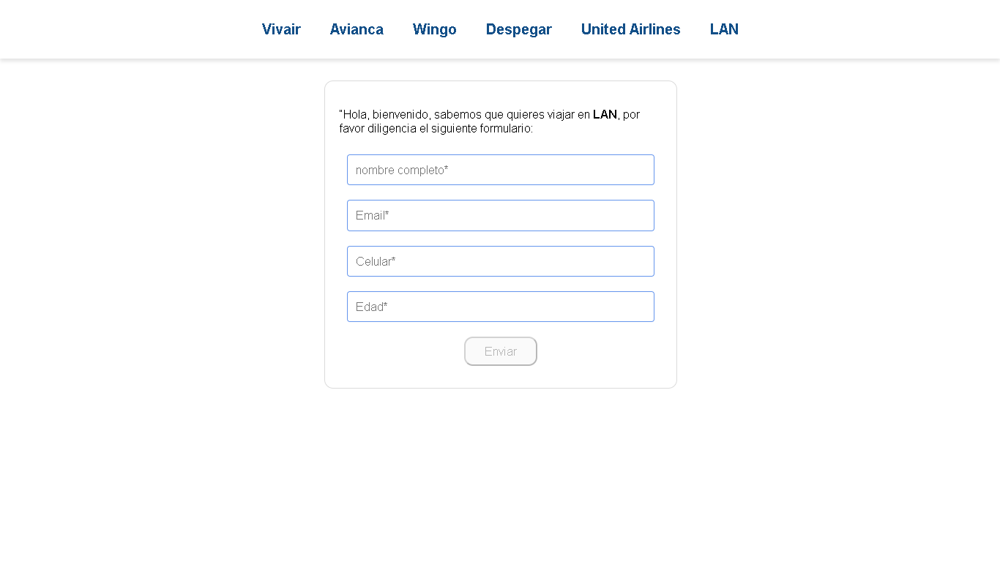
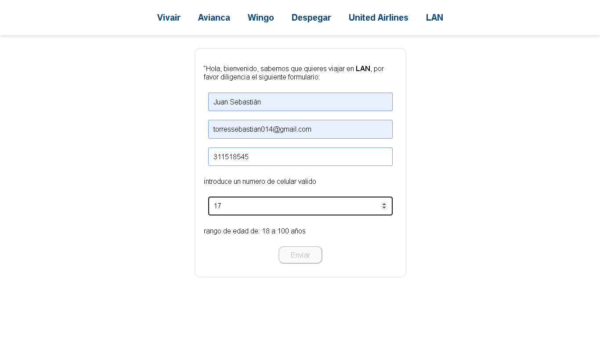
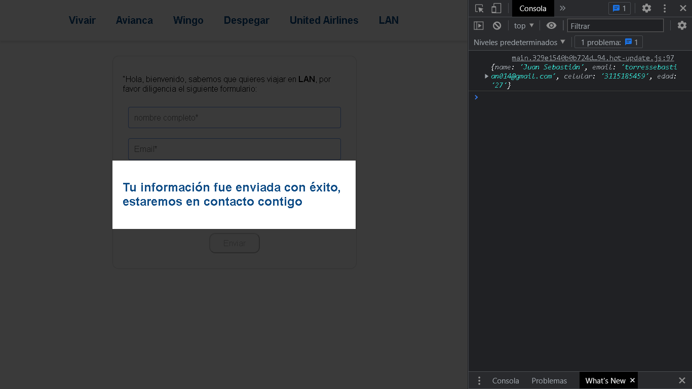
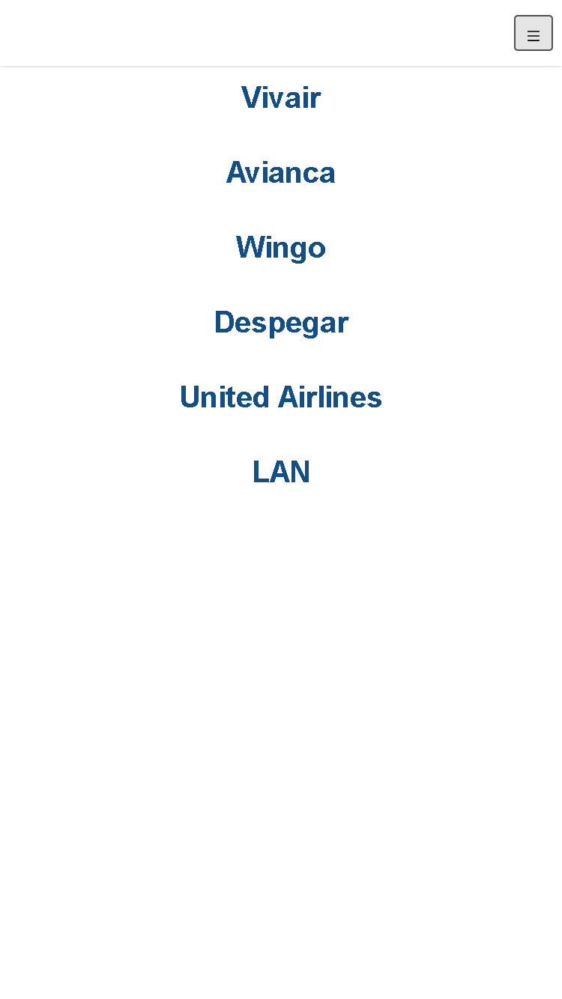
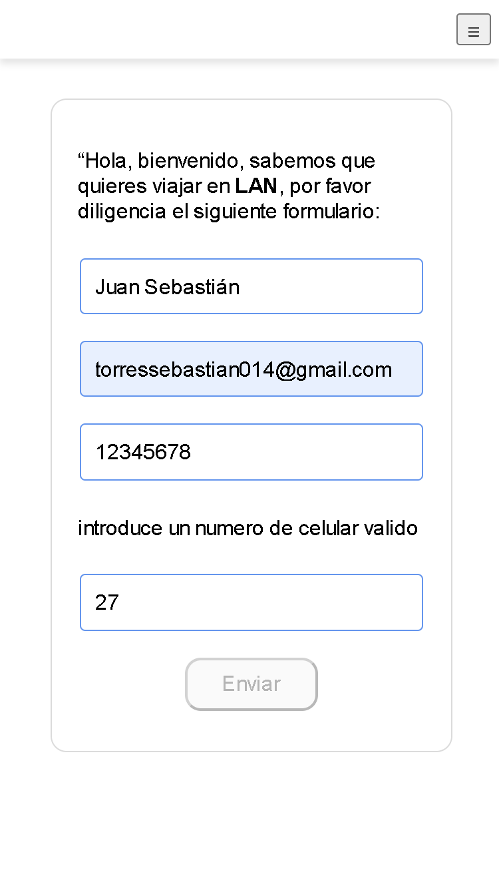
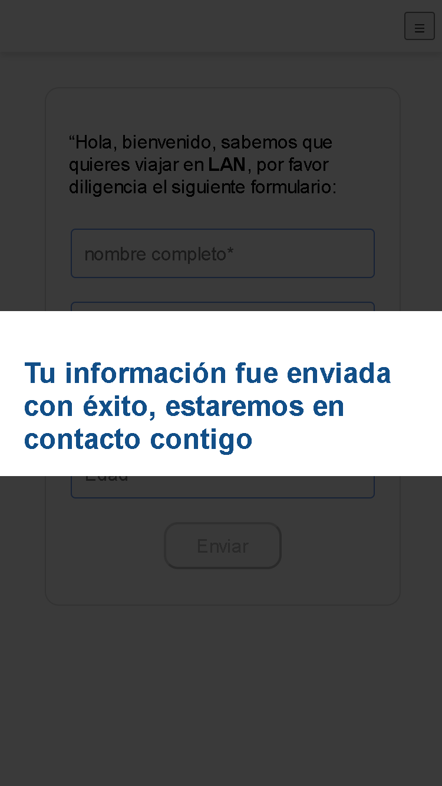

# Prueba técnica

### Dentro de la carpeta del proyecto ejecutar en la terminal el comando: 

> `npm start`

### Para visualizar en el navegador abrir:
### http://localhost:3000

El proyecto incluye normalizado CSS con "normalize CSS" inyectado en el el index HTML para que los estilos se vean igual en todos los navegadores.

## Estructura de archivos
Dentro de la carpeta src se encuentran las carpetas __components__ que contiene los componentes del proyecto y sus respectivos archivos de estilos, y en la carpeta __utils__ donde se encuentra el archivo con un JSON de donde se alimentan los items del menu. 

# Capturas 
## - Modo escritorio

  

  

  

## - Modo movil

  

  

  

